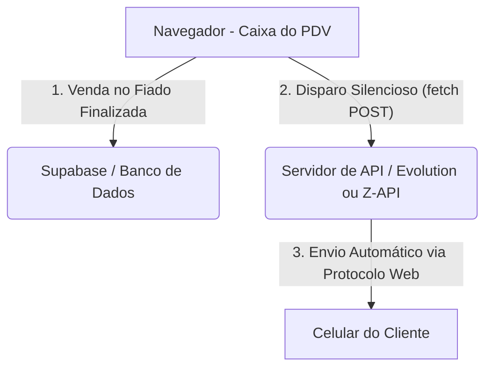

# Ideias e Opções de Integração com o WhatsApp (PDV Ricardo)

Este documento reúne as opções levantadas para implementar o envio automático de extratos de consumo e lembretes de cobrança ("pendura") para os clientes do bar.

---

## Comparativo de Opções de Integração

### Opção A: Click-to-Chat (Manual & 100% Gratuito)
*   **Como funciona:** O sistema gera a mensagem com os gastos do cliente e abre uma aba do WhatsApp com o chat do cliente e o texto já preenchido. O operador só precisa clicar em "Enviar".
*   **Custo:** R$ 0,00 (100% gratuito).
*   **Burocracia:** Nenhuma. Não requer cadastros ou configurações de servidor.
*   **Envio:** Semi-automático (exige um clique humano no aplicativo).
*   **Risco de banimento:** Zero.

---

### Opção B: API de Gateway Não Oficial (Automático & Baixo Custo)
*   **Como funciona:** Conecta-se um número de WhatsApp comum ao sistema através da leitura de um QR Code (como no WhatsApp Web). O sistema envia a mensagem em segundo plano sem qualquer clique humano.
*   **Serviços comuns:** [Z-API](https://z-api.io/), [Evolution API](https://github.com/Evolution-API/evolution-api) (código aberto), DevZapp, etc.
*   **Custo:**
    *   **Pago:** R$ 39,00 a R$ 99,00 por mês (mensalidade fixa com disparos ilimitados).
    *   **Grátis:** Hospedando a *Evolution API* em um servidor próprio gratuito (ex: Render, Railway), exige conhecimentos de infraestrutura.
*   **Burocracia:** Muito baixa. Apenas ler o QR Code uma vez.
*   **Envio:** 100% Automático.
*   **Risco de banimento:** Médio. Caso muitos clientes marquem as mensagens de cobrança como spam, o WhatsApp pode suspender a linha temporariamente.

---

### Opção C: API Cloud Oficial da Meta (Automático & Seguro)
*   **Como funciona:** O sistema se conecta diretamente à infraestrutura da Meta (dona do WhatsApp) para disparar mensagens oficiais. Não precisa de celular conectado.
*   **Custo:**
    *   Primeiras 1.000 conversas por mês iniciadas por clientes são gratuitas.
    *   Conversas de cobrança iniciadas pelo estabelecimento custam de R$ 0,30 a R$ 0,40 por conversa (janela de 24h).
*   **Burocracia:** Alta. Exige ter CNPJ, criar conta no Meta Business Suite, verificar a empresa e usar um número exclusivo de telefone que nunca foi usado no app WhatsApp tradicional.
*   **Envio:** 100% Automático.
*   **Risco de banimento:** Zero. É o canal oficial homologado pela Meta.

---

## Arquitetura da Solução Automática (Exemplo: Opção B)

Abaixo está o diagrama simples de como o sistema operará quando a automação estiver ativa:



### O que precisará ser alterado no código:

1.  **Configurações:** Adicionar campos na página `configuracoes.html` para guardar as credenciais da API (ex: `URL da API`, `Token da Instância` e a `Chave PIX`).
2.  **Lógica de Envio:** Em `js/utils.js`, criar a função de requisição de envio:
    ```javascript
    async function enviarMensagemAutomatica(telefone, texto) {
      const apiURL = await dbGetSetting('whatsapp_api_url');
      const token = await dbGetSetting('whatsapp_api_token');
      
      await fetch(`${apiURL}/send-text`, {
        method: 'POST',
        headers: { 
          'Content-Type': 'application/json',
          'Authorization': `Bearer ${token}` 
        },
        body: JSON.stringify({ number: telefone, message: texto })
      });
    }
    ```
3.  **Gatilhos:** Chamar essa função silenciosamente após o registro do fiado nas funções `finalizeQuickFiado()` e `finalizeSale()`.

---

## Próximos Passos (Quando decidir implementar)
1. Escolher se usará a **Opção A** (gratuita e semi-automática) ou a **Opção B** (automática via gateway).
2. Se escolher a Opção B, contratar ou hospedar a API de gateway escolhida e obter os dados de acesso (URL e Token da instância).
3. Solicitar ao assistente a execução do plano de código correspondente à escolha.
