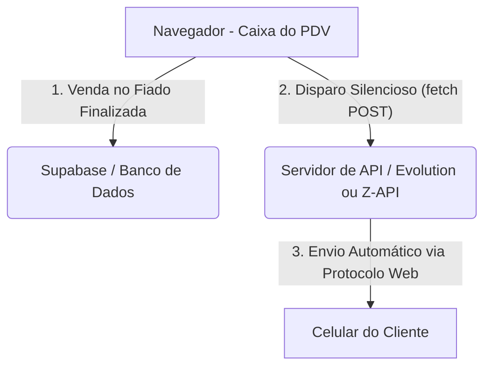

# Ideias e Opções de Integração com o WhatsApp (PDV Ricardo)

Este documento reúne as opções levantadas para implementar o envio automático de extratos de consumo e lembretes de cobrança ("pendura") para os clientes do bar.

---

## Comparativo de Opções de Integração

### Opção A: Click-to-Chat (Manual & 100% Gratuito)
*   **Como funciona:** O sistema gera a mensagem com os gastos do cliente e abre uma aba do WhatsApp com o chat do cliente e o texto já preenchido. O operador só precisa clicar em "Enviar".
*   **Custo:** R$ 0,00 (100% gratuito).
*   **Burocracia:** Nenhuma. Não requer cadastros ou configurações de servidor.
*   **Envio:** Semi-automático (exige um clique humano no aplicativo).
*   **Risco de banimento:** Zero.

---

### Opção B: API de Gateway Não Oficial (Automático & Baixo Custo)
*   **Como funciona:** Conecta-se um número de WhatsApp comum ao sistema através da leitura de um QR Code (como no WhatsApp Web). O sistema envia a mensagem em segundo plano sem qualquer clique humano.
*   **Serviços comuns:** [Z-API](https://z-api.io/), [Evolution API](https://github.com/Evolution-API/evolution-api) (código aberto), DevZapp, etc.
*   **Custo:**
    *   **Pago:** R$ 39,00 a R$ 99,00 por mês (mensalidade fixa com disparos ilimitados).
    *   **Grátis:** Hospedando a *Evolution API* em um servidor próprio gratuito (ex: Render, Railway), exige conhecimentos de infraestrutura.
*   **Burocracia:** Muito baixa. Apenas ler o QR Code uma vez.
*   **Envio:** 100% Automático.
*   **Risco de banimento:** Médio. Caso muitos clientes marquem as mensagens de cobrança como spam, o WhatsApp pode suspender a linha temporariamente.

---

### Opção C: API Cloud Oficial da Meta (Automático & Seguro)
*   **Como funciona:** O sistema se conecta diretamente à infraestrutura da Meta (dona do WhatsApp) para disparar mensagens oficiais. Não precisa de celular conectado.
*   **Custo:**
    *   Primeiras 1.000 conversas por mês iniciadas por clientes são gratuitas.
    *   Conversas de cobrança iniciadas pelo estabelecimento custam de R$ 0,30 a R$ 0,40 por conversa (janela de 24h).
*   **Burocracia:** Alta. Exige ter CNPJ, criar conta no Meta Business Suite, verificar a empresa e usar um número exclusivo de telefone que nunca foi usado no app WhatsApp tradicional.
*   **Envio:** 100% Automático.
*   **Risco de banimento:** Zero. É o canal oficial homologado pela Meta.

---

## Arquitetura da Solução Automática (Exemplo: Opção B)

Abaixo está o diagrama simples de como o sistema operará quando a automação estiver ativa:



### O que precisará ser alterado no código:

1.  **Configurações:** Adicionar campos na página `configuracoes.html` para guardar as credenciais da API (ex: `URL da API`, `Token da Instância` e a `Chave PIX`).
2.  **Lógica de Envio:** Em `js/utils.js`, criar a função de requisição de envio:
    ```javascript
    async function enviarMensagemAutomatica(telefone, texto) {
      const apiURL = await dbGetSetting('whatsapp_api_url');
      const token = await dbGetSetting('whatsapp_api_token');
      
      await fetch(`${apiURL}/send-text`, {
        method: 'POST',
        headers: { 
          'Content-Type': 'application/json',
          'Authorization': `Bearer ${token}` 
        },
        body: JSON.stringify({ number: telefone, message: texto })
      });
    }
    ```
3.  **Gatilhos:** Chamar essa função silenciosamente após o registro do fiado nas funções `finalizeQuickFiado()` e `finalizeSale()`.

---

## Novas Ideias Detalhadas para Implementação

### 1. Notificação Imediata a cada Lançamento no Pendura
*   **Lógica:** Toda vez que uma venda é finalizada no fiado (balcão ou mesa), o frontend detecta o número de telefone do cliente. Se houver telefone, dispara uma requisição POST oculta para o gateway.
*   **Template da Mensagem:**
    ```text
    *Bar do Ricardo - Pendura Lançado* 📝
    
    Olá, [Nome do Cliente]!
    Registramos no seu pendura os seguintes itens:
    • [Quantidade]x [Nome do Item] ([Preço Unitário])
    
    💰 *Valor lançado hoje:* [Valor da Compra]
    📉 *Seu saldo pendente atualizado:* *[Saldo Geral]*
    
    Agradecemos a preferência! 🍻
    ```

### 2. Relatório Diário Consolidado (Extrato Geral)
Existem dois caminhos técnicos para enviar o resumo diário de gastos:
*   **Caminho A (Disparo Manual em Lote - Simples):**
    *   Criamos uma aba "Cobrança" na tela de Clientes ou Caixa.
    *   Um botão `"✉️ Disparar Lembretes de Consumo"` faz o JavaScript ler no banco local/Supabase todos os clientes ativos com saldo devedor.
    *   O sistema monta o texto com o extrato detalhado de tudo o que eles compraram nas datas em aberto e faz disparos sequenciais em segundo plano usando a API de WhatsApp.
*   **Caminho B (Agendador Automático na Nuvem - Avançado):**
    *   Como os dados estão no Supabase, criamos uma **Supabase Edge Function** associada a um **Supabase Vault/Cron Job** (agenda recorrente).
    *   Todos os dias (ex: às 23:30h), o script roda na nuvem do Supabase, calcula as pendências de cada devedor, monta o extrato e faz a chamada HTTP para o gateway de WhatsApp.
    *   *Vantagem:* Funciona de forma 100% autônoma, sem necessidade do computador do bar estar ligado ou do site aberto.

### 3. Geração de QR Code & Copia e Cola PIX
Dá para fazer com que o cliente receba os dados de pagamento direto no WhatsApp.
*   **Pix Copia e Cola (Texto):**
    *   Escrevemos um gerador de payload Pix estático em Javascript no próprio frontend.
    *   Ele monta a string EMV oficial utilizando a chave Pix do estabelecimento (CNPJ, celular, email, ou chave aleatória) e o valor total acumulado do cliente.
    *   A mensagem inclui o código no formato:
        `Para pagar, copie a linha abaixo e cole no app do seu banco:`
        `00020101021226830014br.gov.bcb.pix0136minha-chave-pix-123...`
*   **QR Code (Imagem):**
    *   A string do Pix Copia e Cola gerada é enviada para uma API gratuita de geração de QR Codes por URL (ex: `https://api.qrserver.com/v1/create-qr-code/?data=URL_ENCODED_PIX_PAYLOAD`).
    *   Enviaremos essa URL no formato de mensagem de mídia (imagem) do gateway do WhatsApp.
    *   O cliente recebe o texto explicativo e a imagem do QR Code para leitura imediata.

---

## Próximos Passos (Quando decidir implementar)
1.  **Escolher o Gateway de WhatsApp:** Contratar ou hospedar a API de gateway escolhida (Z-API, Evolution API, etc.) e cadastrar o celular nela via QR Code.
2.  **Configurar Chaves:** Salvar o `Token` e a `URL da API` nas configurações do PDV.
3.  **Habilitar os Recursos:** Solicitar ao assistente a codificação dos módulos de Geração de Pix, Lógica de Mensagem por Venda, Disparo de Relatório e Migração de Configurações no Supabase.
